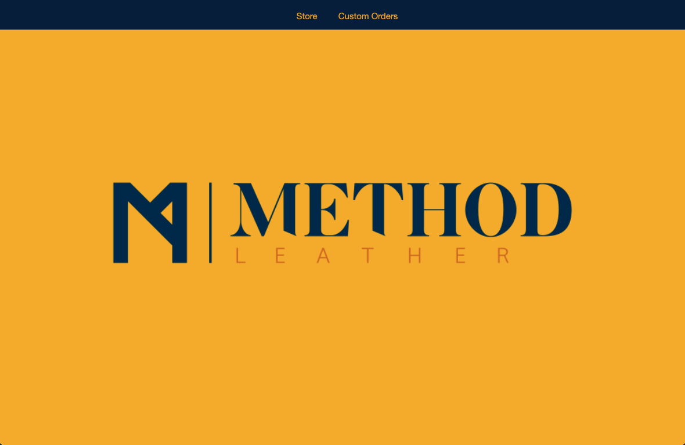
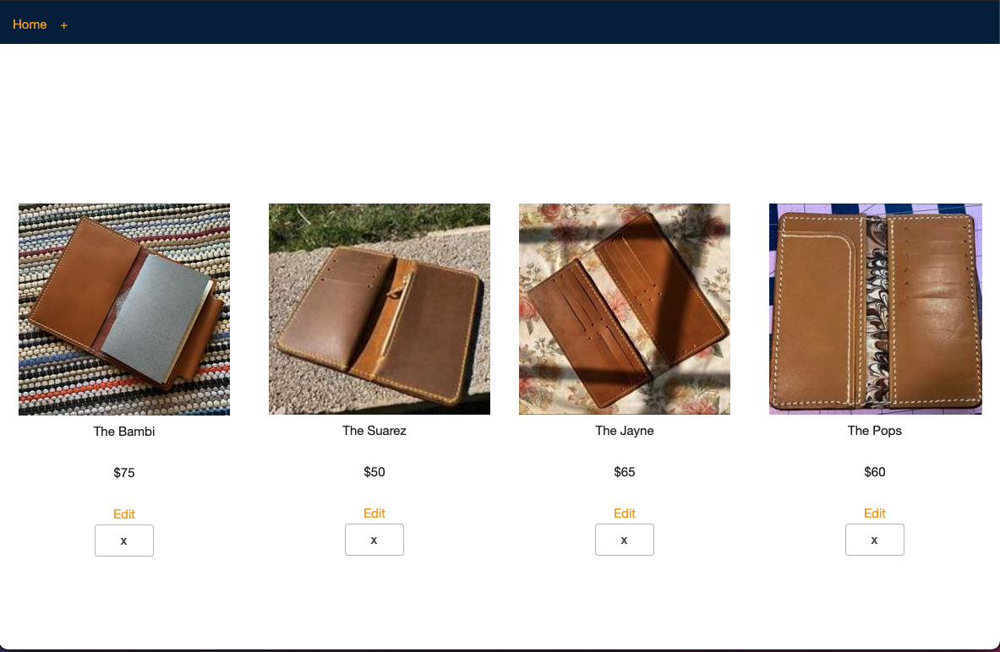
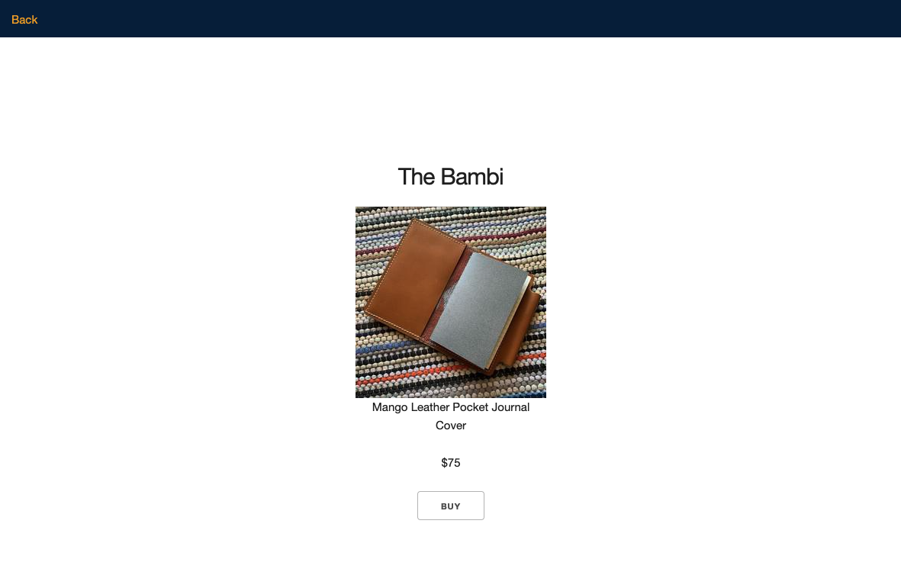
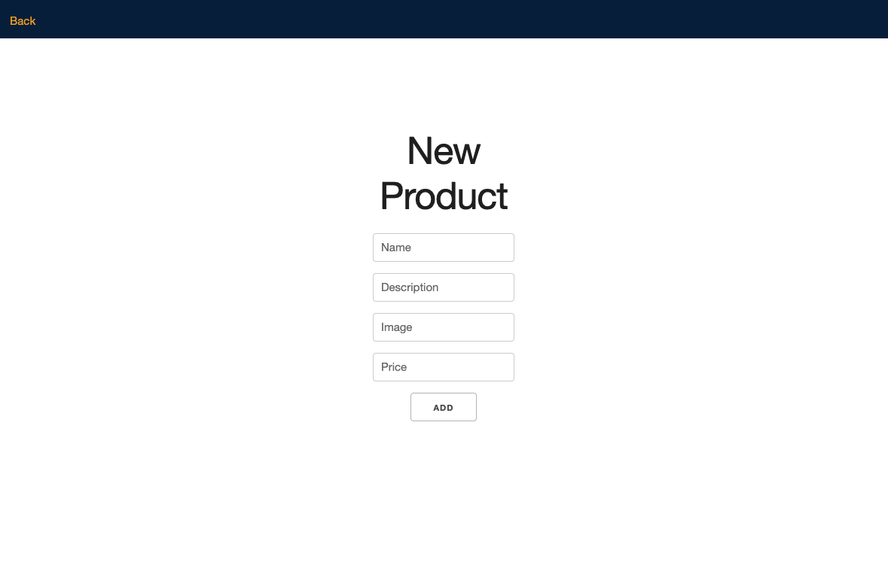
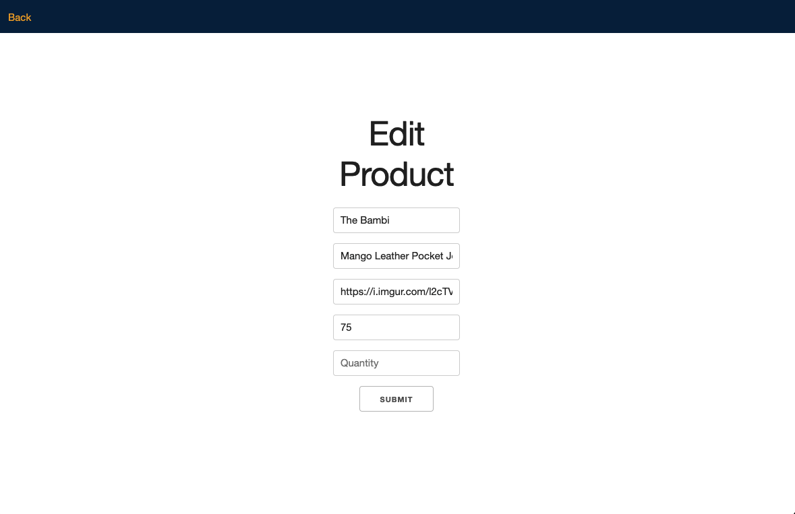

# Method Leather Web Store(In Development)
This is my second project for GA SEIR Program. This is a basic web store application build with express and MongoDB. The content on the site was obtained from Method Leather LLC., founded by Texas Native, Clayton Reed. From cut to stitch, every piece is 100% handmade with true Texas craftsmanship. 

# Technologies Used
    -Mongoose
    -MongoDB
    -Express
    -HTML
    -EJS
    -CSS
    -Skeleton
    -JavaScript
    -InVision App
    -Lucid App

# Screenshots

Home Page

Index Page

Show Page

New Page

Edit Page

# Getting Started
[Click here](https://protected-eyrie-89367.herokuapp.com/home) to see the deployed project. 

# Future Enhancements

    -add logo to header
    -add color and shape to product divs
    -add shopping cart
    =add auth
    =hide edit, add, delete
